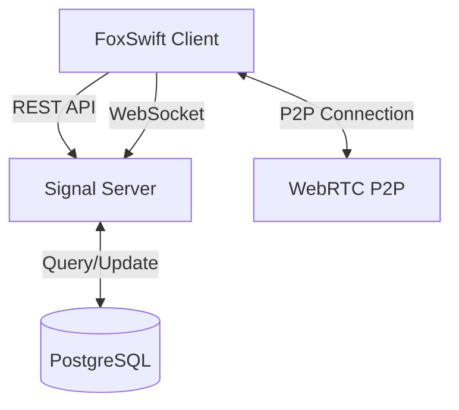
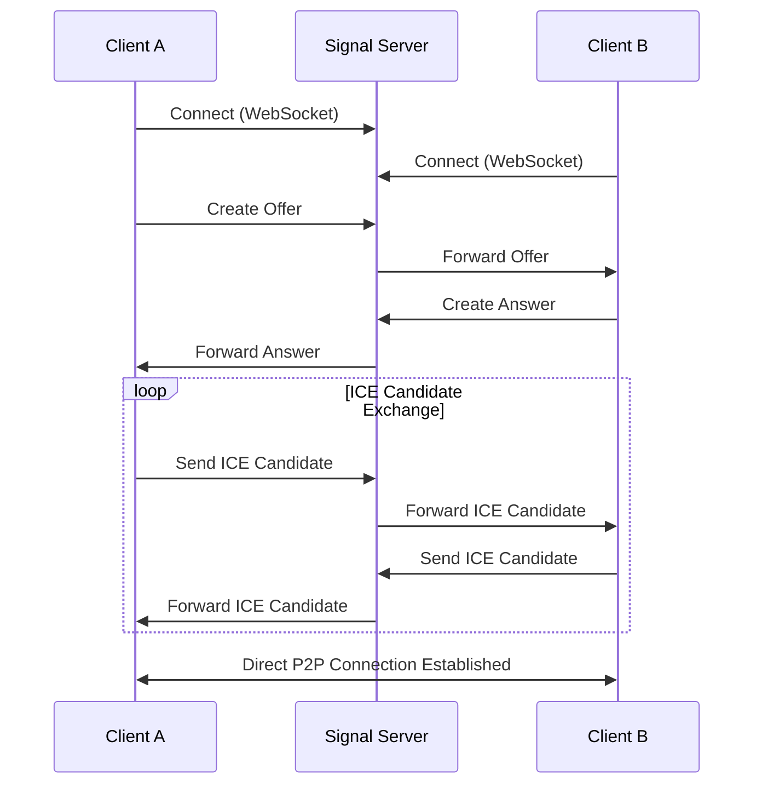

# Architecture Overview

> This file is generated by AI, please check the correctness of the content.

[繁體中文](../zh-TW/architecture.md)

## System Components

### Signal Server

- Handle WebRTC signal exchange
- Manage user connection states
- Provide REST API services
- WebSocket real-time communication

### Database

- Store user information
- Record connection history
- Manage system settings

## Data Flow

### WebRTC Signaling Flow

### State Management

- User State
  - Online/Offline
  - Connection Status
  - Last Seen

- Connection State
  - Signaling
  - Connected
  - Disconnected

## Technology Stack

### Backend

- Vapor
- Swift 6.0
- PostgreSQL
- WebSocket Protocol
- Docker
