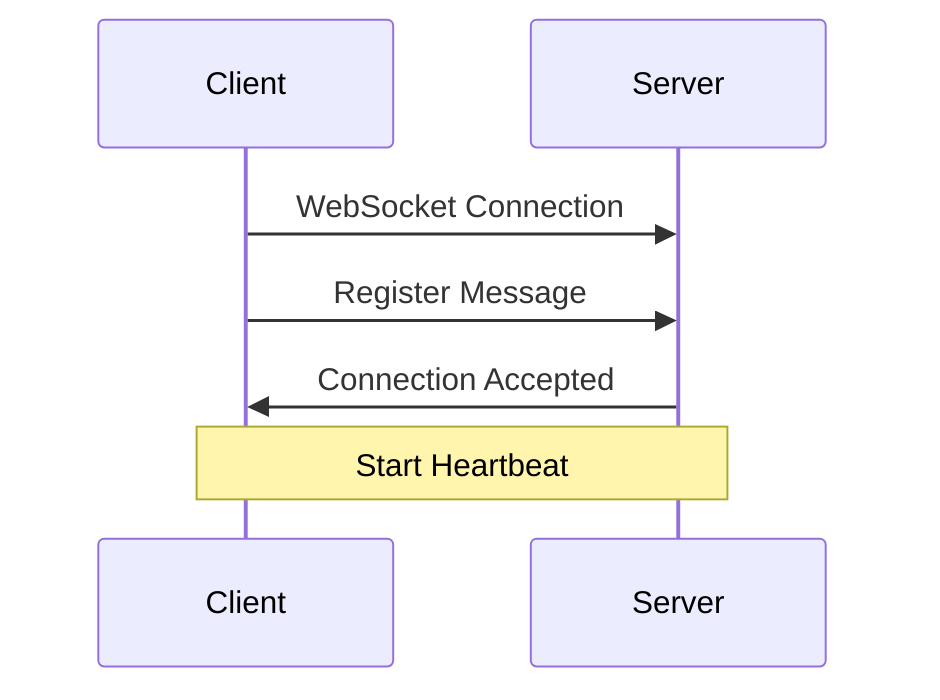
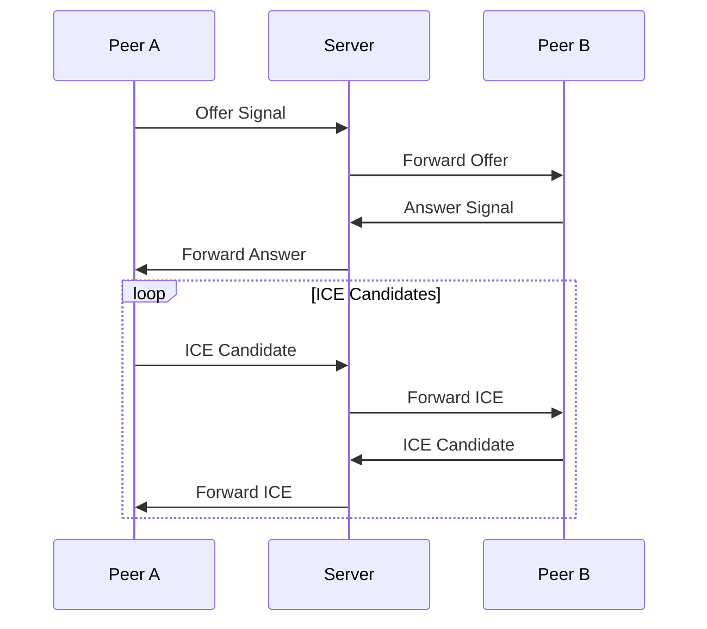

# WebRTC Signaling Protocol

> This file is generated by AI, please check the correctness of the content.

[繁體中文](../zh-TW/signaling.md)

## Overview

FoxSwift uses WebSocket as the signaling channel for WebRTC communication. All messages are transmitted in JSON format and include necessary authentication information.

## Message Format

### Basic Structure

```json
{
    "type": "signal_type",
    "payload": {
        // signal specific data
    },
    "timestamp": "ISO8601 timestamp",
    "sender": "user_id",
    "receiver": "target_user_id"
}
```

### Signal Types

1. Connection Management
   - `register`: Register new connection
   - `disconnect`: Disconnect
   - `heartbeat`: Heartbeat check

2. WebRTC Signaling
   - `offer`: Initiate connection request
   - `answer`: Response to connection request
   - `ice_candidate`: ICE candidate
   - `ice_complete`: ICE gathering complete

3. Status Updates
   - `status_change`: Status change notification
   - `error`: Error message

## Connection Flow

### 1. Initial Connection



### 2. WebRTC Connection



## Example Messages

### Register

```json
{
    "type": "register",
    "payload": {
        "user_id": "user123",
        "device_info": {
            "type": "ios",
            "version": "16.0"
        }
    },
    "timestamp": "2024-01-17T12:00:00Z"
}
```

### Offer Signal

```json
{
    "type": "offer",
    "payload": {
        "sdp": "v=0\no=- 123456...",
        "connection_id": "conn123"
    },
    "timestamp": "2024-01-17T12:01:00Z",
    "sender": "user123",
    "receiver": "user456"
}
```

## Error Handling

### Error Types

1. Connection Errors
   - `connection_lost`: Connection lost
   - `timeout`: Timeout
   - `authentication_failed`: Authentication failed

2. Signal Errors
   - `invalid_signal`: Invalid signal
   - `peer_unavailable`: Peer unavailable
   - `signal_timeout`: Signal timeout

### Error Response

```json
{
    "type": "error",
    "payload": {
        "code": "error_code",
        "message": "Error description",
        "details": {
            // Additional error information
        }
    },
    "timestamp": "2024-01-17T12:00:00Z"
}
```
