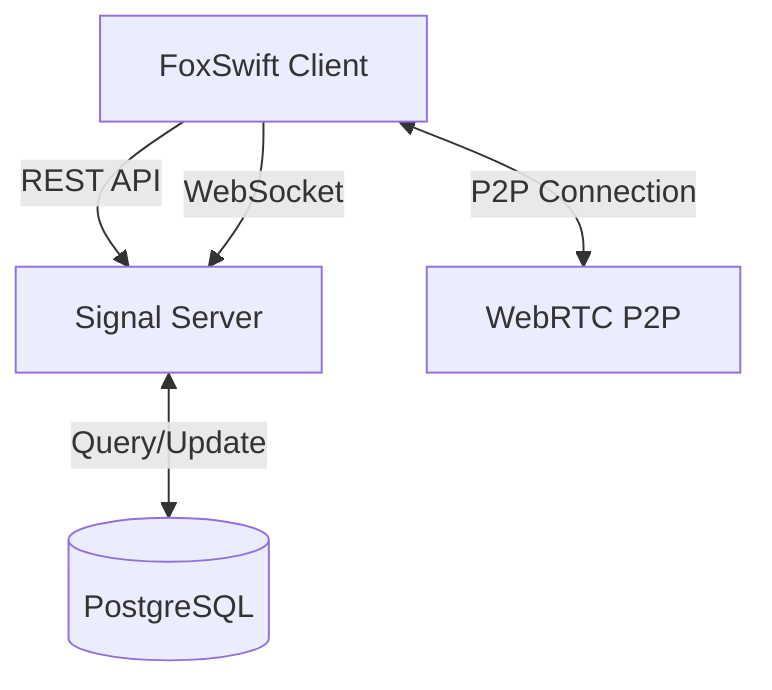
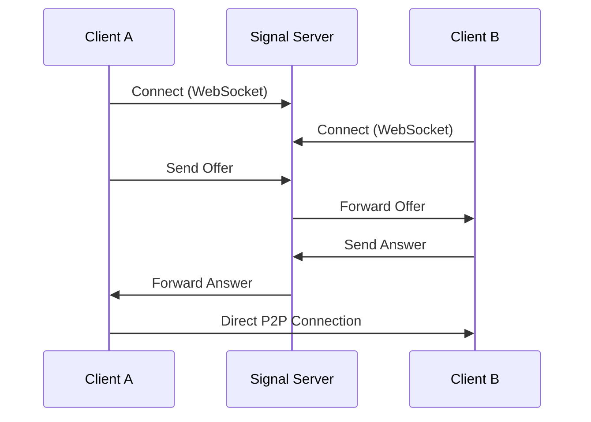

# 架構概覽

> 本文件由 AI 輔助生成，請檢查內容的正確性

## 系統元件

### 信號伺服器

- 處理 WebRTC 信號交換
- 管理使用者連線狀態
- 提供 REST API 服務
- WebSocket 即時通訊

### 資料庫

- 儲存使用者資訊
- 記錄連線歷史
- 管理系統設定

## 資料流

### 信號流程

### 狀態管理

- 使用者狀態
  - Online/Offline
  - Connection Status
  - Last Seen

- 連線狀態
  - Signaling
  - Connected
  - Disconnected

## 技術棧

- Vapor
- Swift 6.0
- PostgreSQL
- WebSocket Protocol
- Docker
