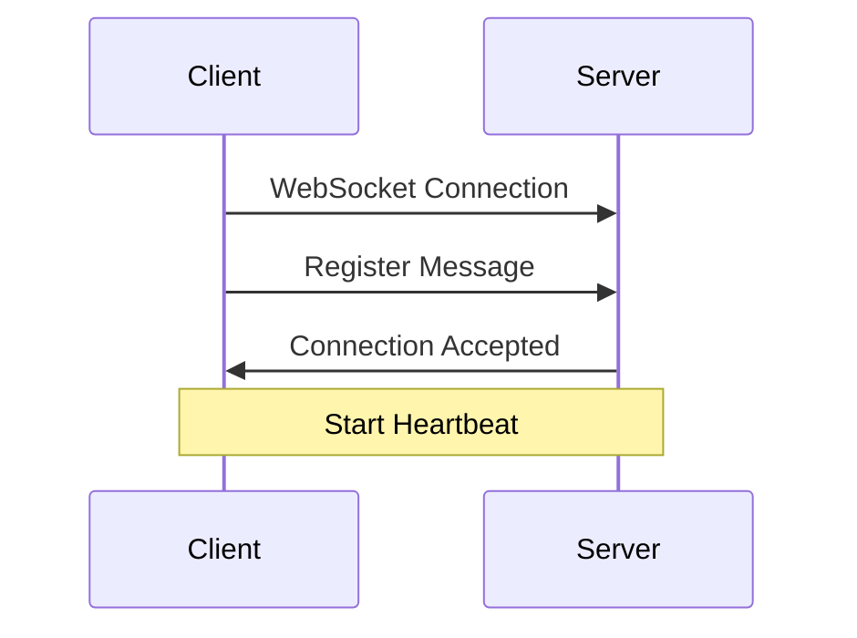
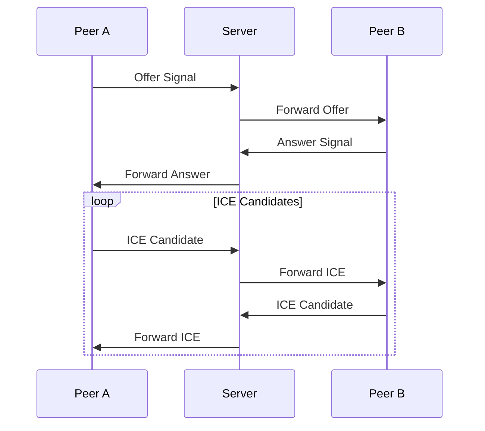

# WebRTC Signaling Protocol

> 本文件由 AI 輔助生成，請檢查內容的正確性

## 概述

FoxSwift 使用 WebSocket 作為 WebRTC 的信號交換通道。所有的訊息都使用 JSON 格式傳輸，並且包含必要的認證資訊。

## 訊息格式

### 基本結構

```json
{
    "type": "signal_type",
    "payload": {
        // signal specific data
    },
    "timestamp": "ISO8601 timestamp",
    "sender": "user_id",
    "receiver": "target_user_id"
}
```

### 信號類型

1. Connection Management
   - `register`: 註冊新連線
   - `disconnect`: 斷開連線
   - `heartbeat`: 心跳檢查

2. WebRTC Signaling
   - `offer`: 發起連線請求
   - `answer`: 回應連線請求
   - `ice_candidate`: ICE 候選項
   - `ice_complete`: ICE 收集完成

3. Status Updates 狀態更新
   - `status_change`: 狀態變更通知
   - `error`: 錯誤訊息

## 連線流程

### 1. 初始連線



### 2. WebRTC 連線



## Example Messages 範例訊息

### Register 註冊

```json
{
    "type": "register",
    "payload": {
        "user_id": "user123",
        "device_info": {
            "type": "ios",
            "version": "16.0"
        }
    },
    "timestamp": "2024-01-17T12:00:00Z"
}
```

### Offer Signal 發起信號

```json
{
    "type": "offer",
    "payload": {
        "sdp": "v=0\no=- 123456...",
        "connection_id": "conn123"
    },
    "timestamp": "2024-01-17T12:01:00Z",
    "sender": "user123",
    "receiver": "user456"
}
```

## 錯誤處理

### Error Types 錯誤類型

1. Connection Errors 連線錯誤
   - `connection_lost`: 連線中斷
   - `timeout`: 超時
   - `authentication_failed`: 認證失敗

2. Signal Errors 信號錯誤
   - `invalid_signal`: 無效信號
   - `peer_unavailable`: 對方不可用
   - `signal_timeout`: 信號超時

### 錯誤回應

```json
{
    "type": "error",
    "payload": {
        "code": "error_code",
        "message": "Error description",
        "details": {
            // Additional error information
        }
    },
    "timestamp": "2024-01-17T12:00:00Z"
}
```
